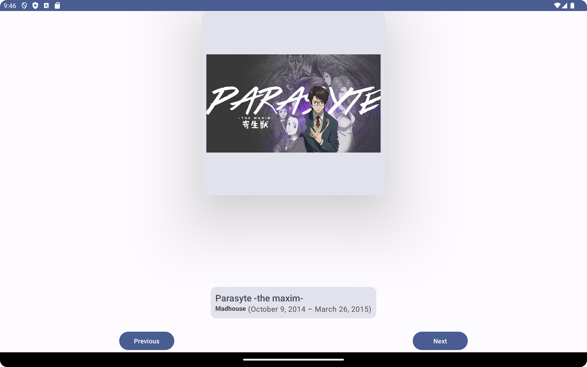
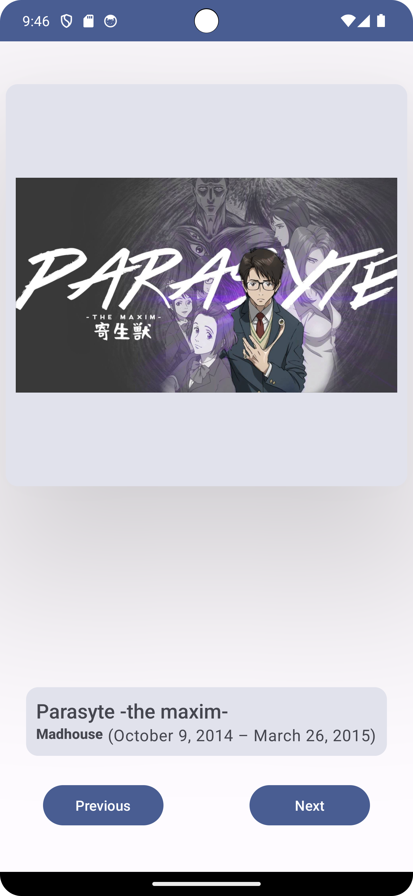
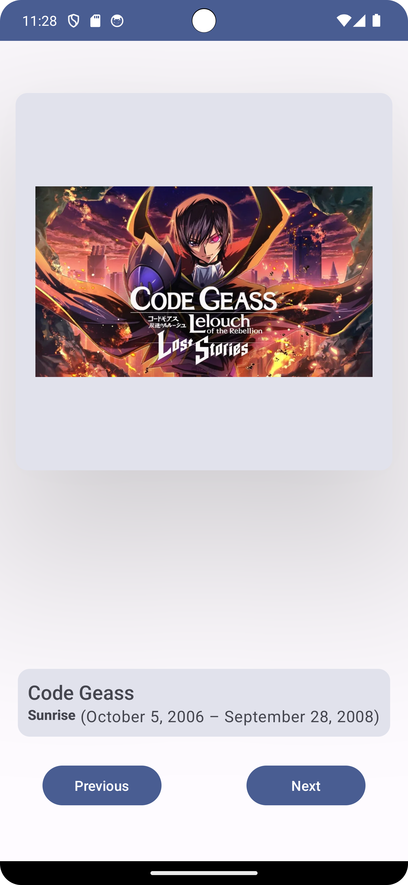

# Art Space - Jetpack Compose Details App

Art Space, built with Jetpack Compose, offers a curated gallery experience showcasing five distinct artistic creations. Featuring captivating images, titles, airing times, and production house details, this app merges creativity with technology under the Learn by Doing initiative. Seamlessly adaptable across devices, it delivers an immersive and user-friendly interface for exploration.
## Overview

Art Space is optimized for both mobile and tablet devices, providing a seamless user interface across various screen sizes. Explore, immerse, and traverse the artistic journey offered by Art Space, where creativity meets technology.

## Features

- Details of 5 artistic creations
- Each creation includes an image, title, airing time, and production house information
- Navigation between details using buttons
- Optimized UI for mobile and tablet devices

## Screenshots

  

## Implementation Details

The app is built using Jetpack Compose and follows a structured approach using composables like `Image`, `Text`, `Row`, `Column`, and `Card`. It uses button-based navigation and adopts the MVVM architecture.

## Project Structure

- `/app/src/main`: Contains the main source code for the Art Space app.
- `/screenshots`: Includes screenshots of the app.

## Setup and Installation

1. Clone the repository.
2. Open the project in Android Studio.
3. Build and run the app on an emulator or physical device.

## Contributions

Contributions to enhance the app's features, UI, or performance are encouraged! Please follow the contribution guidelines mentioned in the repository.

## Credits

This app is part of the Learn by Doing initiative and was created under the guidance of XYZ.

## License

Art Space project is licensed under the [MIT License](LICENSE).
